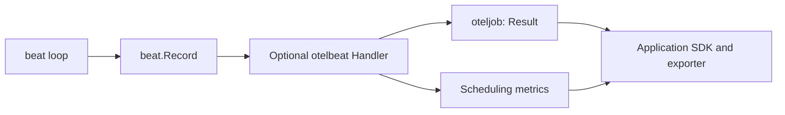

# otelbeat

[](https://pkg.go.dev/github.com/uchaloop/otelbeat) [](https://github.com/uchaloop/otelbeat/actions/workflows/ci.yml) [](LICENSE)

Optional OpenTelemetry metrics for [beat](https://github.com/uchaloop/beat).
Reuses [oteljob](https://github.com/uchaloop/oteljob) for execution metrics and
adds two scheduling instruments. No automatic logs or traces.

## Install

Requires Go 1.27 or later.

```sh
go get github.com/uchaloop/otelbeat
```

## Use

Given an application-configured `metric.MeterProvider` named `provider`:

```go
observer, err := otelbeat.MakeHandler(provider.Meter("example/orders-worker"))
if err != nil {
    return err
}
runner, err := job.MakeRunner(
    job.Config{Timeout: 4 * time.Minute},
    func(ctx context.Context) (int64, error) {
        return processBatch(ctx)
    },
)
if err != nil {
    return err
}
scheduler, err := beat.MakeBeat(
    beat.Config{Period: 5 * time.Minute, Jitter: 5 * time.Minute},
    runner,
    beat.WithHandler(observer),
)
if err != nil {
    return err
}
return scheduler.Start(ctx)
```

The application later calls `scheduler.Stop`, then shuts down its provider with
a fresh bounded context. See [the executable example](example_test.go).

Metrics are optional. Omit `WithHandler`, supply your own `beat.Handler`, or
combine observers with `beat.MultiHandler`. **Do not also deliver the same result
to oteljob**: otelbeat already records execution once. The Meter determines the
instrumentation scope for all four instruments; use a consistent scope per worker.



## Metrics

| Instrument | Type / unit | Attributes | Meaning |
|---|---|---|---|
| `job.run.duration` | Float64Histogram / `s` | `phase`, `outcome` | Work, error processing and total duration |
| `job.run.processed` | Int64Histogram / `{item}` | `outcome` | Reported items per attempt |
| `beat.run.lateness` | Float64Histogram / `s` | `mode` | Nonnegative actual start minus scheduled start |
| `beat.missed` | Int64Counter / `{point}` | `mode` | Unintentional missed scheduled points |

See [oteljob](https://github.com/uchaloop/oteljob) for execution phases, outcome
classification and histogram boundaries. Count completed iterations through
`job.run.duration` with `phase="total"`; `Record.Iteration` is not a metric label
or counter increment. Panic counts use `outcome="panic"` and require recovery.

`mode` is `fixed_rate` or `fixed_delay`; other values become `unknown`.
Lateness requires both Start and ScheduledFor. Offset is already included in
ScheduledFor, so it is not counted as lateness. Negative lateness becomes zero.
Default lateness boundaries in seconds are
`0.001, 0.005, 0.01, 0.025, 0.05, 0.1, 0.25, 0.5, 1, 2.5, 5, 10, 30, 60, 300`.
Override histogram aggregations with SDK Views.

Missed points belong to the preceding gap, not the outcome of the current run.
Intentional backoff and points owned by other clusters are excluded by beat;
fixed-delay mode has no grid to miss. Counts arrive with the next record and can
be lost on shutdown or a blocked run. Each uint64 increment is capped at MaxInt64
before recording; OTel's cumulative signed sum is still limited to int64.

A slow observation Handler can cause missed points without a late start.
Neither duration nor missed points measures queue backlog or processing capacity:
monitor queue depth and oldest-item age separately in your application.

## Prometheus queries

These examples assume classic histograms and the usual dot-to-underscore/unit
name translation. Add your service/environment filters. Windows must contain
sufficient samples; sparse runs do not yield useful short-window quantiles.

```promql
# Completed iterations over an hour
sum(increase(job_run_duration_seconds_count{phase="total"}[1h]))

# Failed attempts, excluding shutdown cancellations
sum(increase(job_run_duration_seconds_count{
  phase="total", outcome=~"error|panic|timeout"
}[1h]))

# Recovered panics
sum(increase(job_run_duration_seconds_count{phase="total",outcome="panic"}[1h]))

# p95 work duration
histogram_quantile(0.95,
  sum by (le) (rate(job_run_duration_seconds_bucket{phase="work"}[1h])))

# Average reported batch size (no samples means undefined)
sum(increase(job_run_processed_sum[1h]))
/
sum(increase(job_run_processed_count[1h]))

# Missed points
sum(increase(beat_missed_total[1h]))
```

These rate/increase examples suit repeatedly sampled daemon series. They do not
reliably count one-sample ephemeral job series; see oteljob's export guidance.

## Identity and SDK ownership

The application provides Resource, Views, reader/exporter and provider shutdown.
Use `service.name`, `deployment.environment.name`, and in Kubernetes
`k8s.cluster.name` and `k8s.namespace.name` for filtering. Configure selected
Resource-to-label promotion in your pipeline and preserve distinct replica
identity. The adapter does not discover Kubernetes, read environment variables
or attach pod names, error text or iteration IDs to observations.

Use the independent [otelbeatfx](https://github.com/uchaloop/otelbeatfx)
module to provide a `beat.Handler` from an application-supplied
`metric.MeterProvider`. `beatfx.Module()` picks it up automatically and uses
the `*job.Runner` supplied by your service domain. This setup does not require
`jobfx` or `oteljobfx`.
SDK lifecycle remains with the application; otelbeat has no Fx dependency.

## Environment configuration

Read telemetry identity from the standard OTel environment variables when the
application constructs its MeterProvider. The adapters consume that provider;
they do not read environment variables themselves. No separate configuration
library is needed for these values.

| Environment variable | Value |
| --- | --- |
| `OTEL_SERVICE_NAME` | Set to a stable service name, such as `daemon-efiro`. |
| `OTEL_RESOURCE_ATTRIBUTES` | Comma-separated `key=value` Resource attributes, as below. |

Recommended attributes inside `OTEL_RESOURCE_ATTRIBUTES`:

| Attribute | When to set it |
| --- | --- |
| `deployment.environment.name` | Local, staging or production environment. |
| `service.instance.id` | A unique identity for each concurrently running instance. |
| `k8s.namespace.name` | Kubernetes namespace; omit outside Kubernetes. |
| `k8s.cluster.name` | Kubernetes cluster name; omit outside Kubernetes. |

These are application identity conventions, not required configuration fields
of the handler. `OTEL_SERVICE_NAME` takes precedence over `service.name` inside
`OTEL_RESOURCE_ATTRIBUTES`. Set identity before constructing the provider;
changing the environment afterward does not refresh its Resource.

Local example (use a distinct instance ID for each concurrent process):

```sh
export OTEL_SERVICE_NAME=worker
export OTEL_RESOURCE_ATTRIBUTES='deployment.environment.name=local,service.instance.id=worker-local-1'
```

In Kubernetes, obtain the namespace (`metadata.namespace`) and Pod identity
(`metadata.uid`) through the
[Downward API](https://kubernetes.io/docs/tasks/inject-data-application/environment-variable-expose-pod-information/).
Supply the service name, deployment environment and cluster name through your
deployment configuration. To compose `OTEL_RESOURCE_ATTRIBUTES` from these values,
follow Kubernetes' official guide to
[dependent environment variables](https://kubernetes.io/docs/tasks/inject-data-application/define-interdependent-environment-variables/).

`resource.WithFromEnv()` reads these values. It does not configure an exporter.
Select a reader/exporter separately; exporter-specific environment variables
(such as an OTLP endpoint) only apply when that exporter is constructed.
Resource attributes also do not automatically become Prometheus labels: configure
selected Resource-to-label promotion in your exporter or Collector and preserve
distinct replica identity.

Read the Resource while constructing the provider in your application:

```go
import (
    "context"

    "go.opentelemetry.io/otel/sdk/resource"
    sdkmetric "go.opentelemetry.io/otel/sdk/metric"
)

func makeMeterProvider(reader sdkmetric.Reader) (*sdkmetric.MeterProvider, error) {
    res, err := resource.New(context.Background(), resource.WithFromEnv())
    if err != nil {
        return nil, err
    }
    return sdkmetric.NewMeterProvider(
        sdkmetric.WithResource(res),
        sdkmetric.WithReader(reader),
    ), nil
}
```

Pass a Meter from this provider to `MakeHandler`. The application owns provider
shutdown with a fresh, bounded context after work and observation finish.

## Grafana dashboard

[Beat dashboard](examples/grafana/beat.json) · [Setup and metric contract](examples/grafana/README.md)

Execution statistics and scheduling panels for the metrics emitted by this adapter.

### Large counter values

The adapter caps each `Missed` increment at `math.MaxInt64` before passing it to
OTel. This does not guarantee exact SDK aggregation at extreme values: OTel Go
SDK 1.45/1.46 converts integer sums through `float64`, which can lose precision
above 2^53 and report a negative value near MaxInt64 on amd64. See the
[upstream issue](https://github.com/open-telemetry/opentelemetry-go/issues/8785).
Cumulative signed sums can also overflow when multiple increments exceed their
range. The adapter does not maintain its own cumulative counter.

## Acknowledgements

Thanks to the authors and maintainers of [OpenTelemetry Go](https://github.com/open-telemetry/opentelemetry-go)
for their instrumentation API and SDK.
